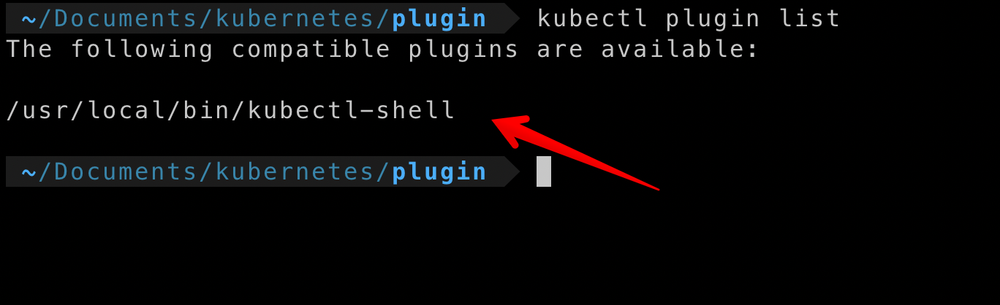

# Kubectl shell

**Kubectl shell** is the [Kubernetes-plugin](https://kubernetes.io/docs/tasks/extend-kubectl/kubectl-plugins/) which helps to get shell inside the container/pods

## Installation
- Download the [binary] from [here](kubectl-shell) 
- Move it to the PATH Location

```
sudo cp kubectl-shell /usr/local/bin
```

Once you moved verify the plugin is installed by typing the below command in the terminal

```
$ kubectl plugin list
```


## Usage

```
usage: kubectl shell  [pod-name]/[container-name] [namespace][optional]
eg kubectl shell hello-world
or
kubectl shell hello-world  default
```

## Demo
